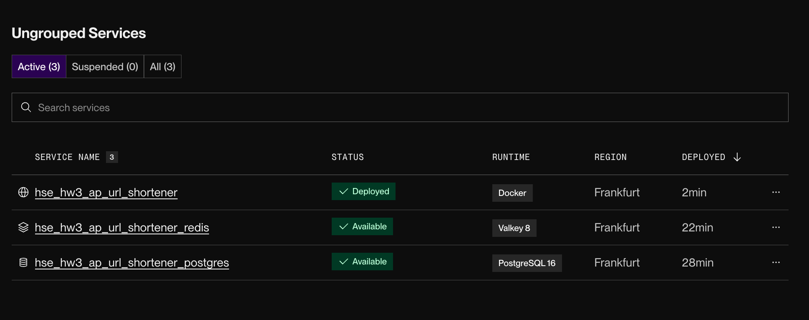
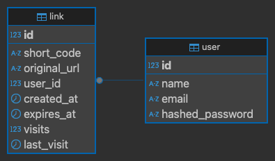

# Описание API


| Название                   | Метод  | Endpoint                                         | Аутентификация | Описание                                                    | Тело запроса                                                                            |
|----------------------------|--------|--------------------------------------------------|----------------|-------------------------------------------------------------|-----------------------------------------------------------------------------------------|
| Удалить ссылку             | DELETE | http://localhost:8000/links/{{short_code}}       | Bearer Token   | Удаляет ссылку.                                             | `{ "original_url": "https://youtube.com" }`                                             |
| Логин                      | POST   | http://localhost:8000/auth/login                 | Нет            | Авторизует пользователя по email и паролю.                  | `{ "email": "sample@a.nl", "password": "abcde1" }`                                      |
| Регистрация                | POST   | http://localhost:8000/auth/register              | Нет            | Регистрирует нового пользователя с email, паролем и именем. | `{ "email": "sample@a.nl", "password": "abcde1", "name": "Sample" }`                    |
| Информация о пользователе  | GET    | http://localhost:8000/auth/whoami                | Bearer token   | Отдает информацию о текущем пользователе.                   | -                                                                                       |
| Поиск                      | GET    | http://localhost:8000/links/search               | Bearer Token   | Ищет ссылки на original_url.                                | -                                                                                       | 
| Создать (сократить) ссылку | POST   | http://localhost:8000/links/shorten              | Bearer Token   | Создает ссылку с необязательной датой просрочки.            | `{ "original_url": "https://youtube.com", "expires_at": "2025-03-26T19:15:53.625853" }` |
| Статистика                 | GET    | http://localhost:8000/links/{{short_code}}/stats | Bearer Token   | Выдает статистику для ссылки.                               | -                                                                                       |
| Обновить ссылку            | PUT    | http://localhost:8000/links/{{short_code}}       | Bearer Token   | Обновляет оригинальный URL ссылки.                          | `{ "original_url": "https://youtube.com" }`                                             |


# Примеры запросов

- Авторизация: 
  - ```
    POST http://localhost:8000/auth/login
    {
      "email": "workgm1@mail.ru",
      "password": "abcde1"
    }
  
    > 200 OK
    {
      "token": "eyJhbGciOiJIUzI1NiIsInR5cCI6IkpXVCJ9..."
    }
    ```
  
- Регистрация
  - ```
    POST http://localhost:8000/auth/register
    {
      "email": "sample@a.nl",
      "password": "abcde1",
      "name": "Sample"
    }
  
    > 201 Created
    {
      "message": "User registered successfully"
    }
    ```

- Сокращение ссылки
  - ```
    POST http://localhost:8000/links/shorten
    {
      "original_url": "https://example.com",
      "expires_at": "2025-03-26T19:15:53.625853"
    }
  
    > 201 Created
    {
      "short_url": "http://localhost:8000/abc123",
      "original_url": "https://example.com",
      "expires_at": "2025-03-26T19:15:53.625853"
    }
    ```

# Deploy

Задеплоено на Render.com, живость зависит исключительно от этого сервиса



Примеры:
- https://hse-hw3-ap-url-shortener.onrender.com/links/QCSntE
- https://hse-hw3-ap-url-shortener.onrender.com/links/u7RKVx
- https://hse-hw3-ap-url-shortener.onrender.com/links/is_this_a_rickroll

# Инструкция по запуску

1. Склонировать репозиторий и перейти в его корневую папку
2. Поменять SECRET_KEY в .env по соображениям безопасности, если актуально
3. Сконфигурировать другие параметры в .env, если необходимо
4. Исполнить `docker-compose up`
5. Использовать сервис на `localhost:8000/*` в соответствии с описанием

# Описание БД

## Redis

Используется для кэша. Хранятся key-value записи: `link:{short_code}` к URL ссылки соответственно.
В фоне рабоатет процесс собирающий топ-10 ссылок каждые n секунд

## Postgres



Создано 2 таблицы: для ссылок `link` и для пользователей `user`.

Для `link` поддерживается:

- `id`
- `short_code` - алиас ссылки
- `original_url` - оригинальный url
- `user_id` - id автора,
- `created_at` - время создания ссылки
- `expires_at` - время просрочки ссылки
- `visits` - количество переходов
- `last_visit` - дата-время последнего перехода

Для `user`:

- `id`
- `name` - имя пользователя (неуникальное)
- `email` - уникальный адрес почты
- `hashed_password` - хэш от
  пароля 

# Запуск тестов

1. Склонировать репозиторий, перейти в корневую папку
2. Установить зависимости: `poetry install`
3. Запустить выполнение тестов с замером покрытия: `poetry run coverage run -m pytest`
4. Сформировать HTML отчет о покрытии: `poetry run coverage html`

# Отчет о покрытии

Можно посмотреть актуальный на момент сдачи ДЗ 4 ответ о покрытии без запуска кода.

Подробнее в [showcase_coverage_report](showcase_coverage_report/README.md)