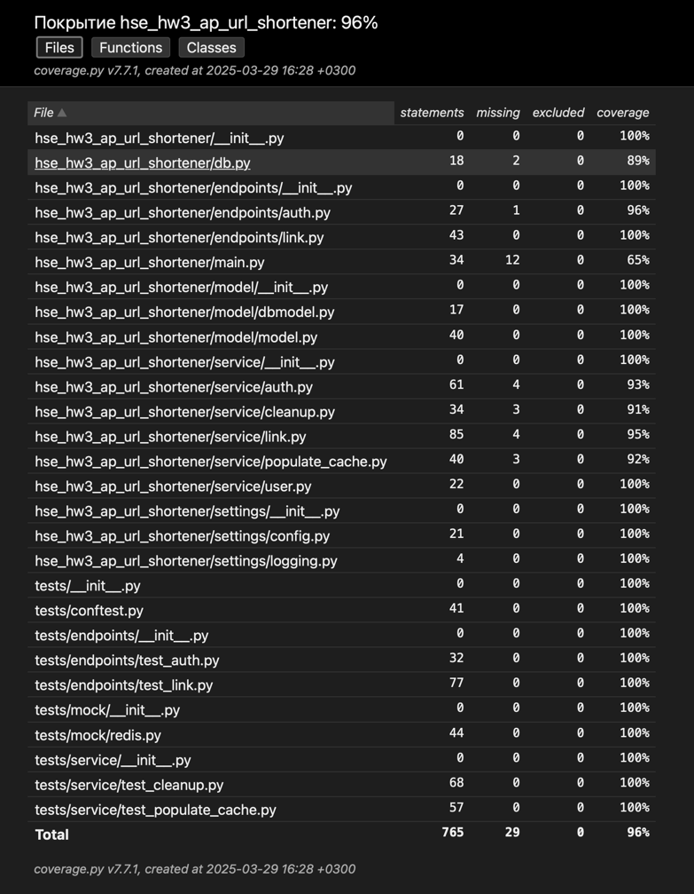

# Отчет о покрытии

Закоммитил исходя из задания. Не уверен, что будет нормально отображаться на GitHub

Информация о покрытии актуальна на момент сдачи ДЗ 4.

## HTML

Скриншот:

- [Папка html](html)
  содержит HTML версию отчета. Скорее всего в Web не откроется, приедтся клонировать к себе и
  открывать [index.html](html/index.html) в браузере

## XML

- [Папка xml](xml)
  содержит [XML версию отчета (showcase_coverage.xml)](xml/showcase_coverage.xml)
